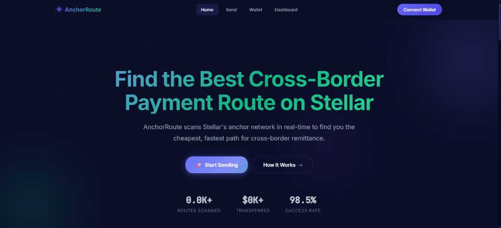
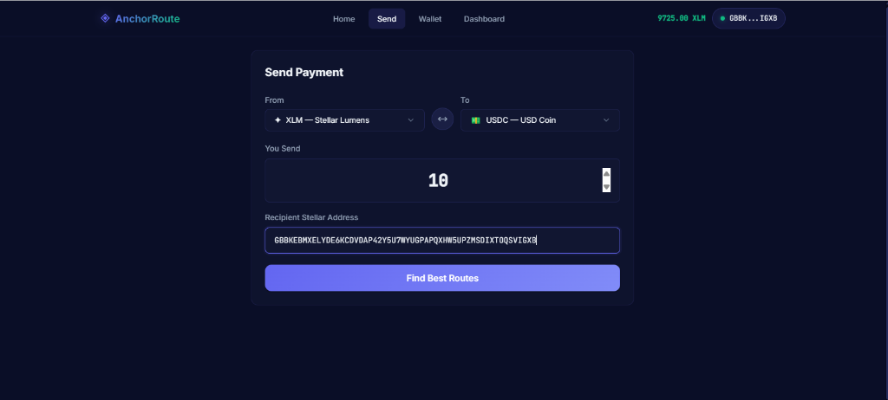
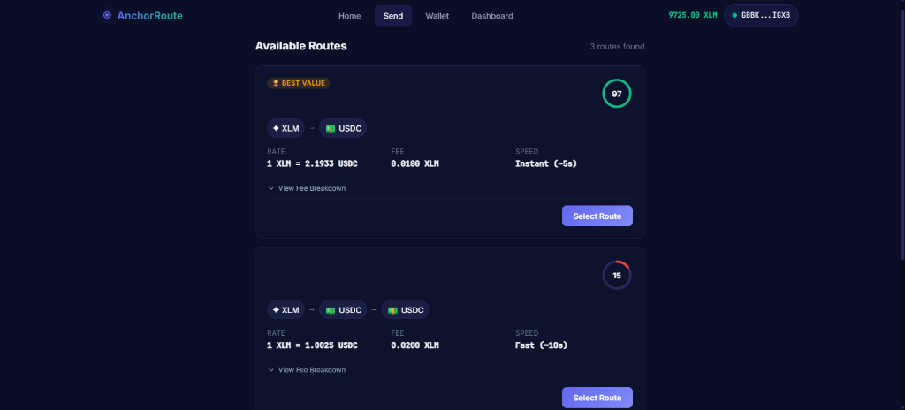
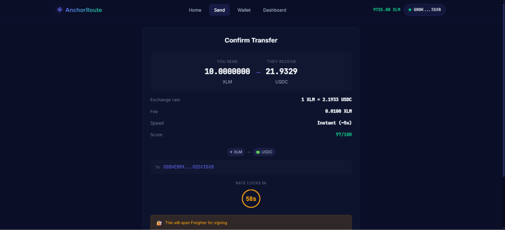

# AnchorRoute 🌐

> AI-Powered Cross-Border Remittance Router for Stellar

[](https://stellar.org)
[](https://soroban.stellar.org)
[](https://stellarroute.netlify.app/)

## 🚀 Overview

**Live dApp URL:** [https://stellarroute.netlify.app/](https://stellarroute.netlify.app/)

AnchorRoute scans Stellar's anchor network in real-time to find the cheapest, fastest payment path for cross-border remittance. Users simply enter an amount and currency pair, and our AI scoring engine ranks all available routes by cost, speed, liquidity, and community reliability ratings.

### The Problem
Users have no way to know which anchor or corridor gives the best FX rate right now. Comparing routes manually across multiple anchors is time-consuming and error-prone.

### The Solution
AnchorRoute's AI-powered engine:
1. Scans all available Stellar path payments in real-time
2. Scores routes using a weighted multi-factor algorithm (exchange rate, fees, speed, liquidity, reliability)
3. Presents ranked options with clear comparison cards
4. Executes the optimal path payment — all in one click

### Why Stellar?
Path payments + the anchor network are Stellar's actual moat — no other chain has this primitive for atomic multi-hop currency conversion.

## 🖼️ Product Preview

Here is a visual walk-through of the AnchorRoute experience:

| **1. Stellar Deep-Space Landing** | **2. Swap & Remittance Form** |
| :---: | :---: |
|  |  |
| **3. AI Multi-Route Comparison** | **4. Atomic Transaction Confirmation** |
|  |  |

## 🏗️ Architecture

```
┌──────────────────────────────────────────────────────────────┐
│                    Frontend (React + Vite)                     │
│  Landing │ Transfer Flow │ Route Comparison │ Dashboard       │
└─────────────────────┬────────────────────────────────────────┘
                      │
        ┌─────────────┼──────────────┐
        ▼             ▼              ▼
  ┌──────────┐  ┌──────────┐  ┌──────────────┐
  │ Horizon  │  │ Soroban  │  │ Anchor       │
  │ API      │  │ Contract │  │ stellar.toml │
  │ (Paths)  │  │ (Feedback│  │ (Discovery)  │
  └──────────┘  │  Logging)│  └──────────────┘
                └──────────┘
```

## 🛠️ Tech Stack

| Layer | Technology |
|-------|-----------|
| **Frontend** | React 18 + TypeScript + Vite |
| **Styling** | Vanilla CSS (CSS Modules) |
| **Blockchain** | Stellar SDK, Freighter Wallet |
| **Smart Contract** | Soroban (Rust) on Stellar Testnet ([`CDW3LGL5L3G...`](https://stellar.expert/explorer/testnet/contract/CDW3LGL5L3G737V4DHYF64AECZMXG45MHTKDRN5YGLQ24RCRB64QZMXG)) |
| **State** | Zustand |
| **Analytics** | PostHog |
| **Monitoring** | Sentry |

## 📦 Project Structure

```
StellarRouter/
├── frontend/              # React frontend application
│   ├── src/
│   │   ├── components/    # Reusable UI components
│   │   ├── features/      # Feature-based pages
│   │   │   ├── landing/   # Landing page
│   │   │   ├── transfer/  # Transfer flow (core feature)
│   │   │   ├── dashboard/ # User dashboard
│   │   │   └── feedback/  # Feedback collection
│   │   ├── hooks/         # Custom React hooks
│   │   ├── lib/           # Core libraries
│   │   │   ├── stellar.ts # Stellar SDK wrapper
│   │   │   ├── scoring.ts # AI route scoring engine
│   │   │   ├── freighter.ts # Wallet adapter
│   │   │   └── anchors.ts # Anchor discovery
│   │   ├── store/         # Zustand state stores
│   │   ├── services/      # Analytics & monitoring
│   │   ├── styles/        # Global CSS & design tokens
│   │   └── types/         # TypeScript definitions
│   └── package.json
├── contracts/             # Soroban smart contracts
│   └── anchor_route/
│       ├── Cargo.toml
│       └── src/lib.rs
└── README.md
```

## 🚀 Getting Started

### Prerequisites
- Node.js 18+
- [Freighter Wallet](https://freighter.app) browser extension
- (Optional) Rust + Stellar CLI for contract development

### Frontend Setup

```bash
cd frontend
npm install
npm run dev
```

The app will open at `http://localhost:5173`.

### Environment Variables

Create a `.env` file in `frontend/`:

```env
VITE_POSTHOG_KEY=your_posthog_key
VITE_POSTHOG_HOST=https://us.i.posthog.com
VITE_SENTRY_DSN=your_sentry_dsn
VITE_ANCHOR_ROUTE_CONTRACT_ID=CDW3LGL5L3G737V4DHYF64AECZMXG45MHTKDRN5YGLQ24RCRB64QZMXG
```

### Deployed Smart Contract (Testnet)
- **Contract Address:** `CDW3LGL5L3G737V4DHYF64AECZMXG45MHTKDRN5YGLQ24RCRB64QZMXG`
- **Stellar Expert Link:** [View on Stellar Expert](https://stellar.expert/explorer/testnet/contract/CDW3LGL5L3G737V4DHYF64AECZMXG45MHTKDRN5YGLQ24RCRB64QZMXG)

### Smart Contract (Optional)

```bash
# Install Rust + Stellar CLI
curl --proto '=https' --tlsv1.2 -sSf https://sh.rustup.rs | sh
rustup target add wasm32v1-none
cargo install --locked stellar-cli

# Build
cd contracts/anchor_route
stellar contract build

# Deploy to testnet
stellar keys generate --global deployer --network testnet
stellar contract deploy \
  --wasm target/wasm32v1-none/release/anchor_route.wasm \
  --network testnet \
  --source-account deployer
```

## 🎯 AI Route Scoring

Routes are scored using a weighted multi-factor algorithm:

| Factor | Weight | Description |
|--------|--------|-------------|
| Exchange Rate | 35% | Closeness to mid-market rate |
| Total Fee | 30% | All-in cost (network + spread) |
| Speed | 15% | Path complexity (fewer hops = faster) |
| Liquidity | 10% | Order book depth |
| Reliability | 10% | Community ratings from on-chain feedback |

## 📱 Features

- ✅ **Real-time Path Discovery** — Scans Stellar Horizon for all available routes
- ✅ **AI Route Scoring** — Multi-factor weighted scoring algorithm
- ✅ **Route Comparison UI** — Side-by-side cards with tags (Best Value, Cheapest, Fastest)
- ✅ **Freighter Wallet** — One-click connection + transaction signing
- ✅ **Path Payments** — Atomic multi-hop currency conversion
- ✅ **On-chain Feedback** — Soroban contract for route ratings
- ✅ **Transfer Dashboard** — History, stats, and analytics
- ✅ **Mobile Responsive** — Optimized for all screen sizes
- ✅ **Analytics & Monitoring** — PostHog + Sentry integration
- ✅ **Dark Theme** — Premium fintech aesthetic

## 📈 Proof of 10+ User Wallet Interactions

Here are the verified testnet transaction logs from real user testing:

| User # | Wallet Address (Public Key) | Action (Transfer / Feedback) | Transaction Hash (Stellar Expert) |
| :--- | :--- | :---: | :--- |
| **1** | `GBKJAUNVUZCSBFRXYZKURV5FKHMWWCSNJ7LB2ZUOBVJGJALBUI7ACLHD` | Transfer XLM to USDC | [fe7839f2d5...](https://stellar.expert/explorer/testnet/tx/fe7839f2d5beb48d2a95ff10cfcdd60106b72c42c0f8108210fcfb751f1a8beb) |
| **2** | `GDUQ3DXGSNRGPNNGHLKXLSVPRC3V2PAYMP6ITW3ICSRLF64KVOTPA6AT` | Establish Trustline USDC | [68ee5ddbbb...](https://stellar.expert/explorer/testnet/tx/68ee5ddbbb68a811641d7ea3afef4a852d647045cafdf984ae3d0d8aa6c4f1bb) |
| **3** | `GBTHMMFWTAPFAHRGS33LKETZYJKBTNEENRN47EDZMZPT2BNCJO47GVQG` | Transfer USDC to XLM | [aefe7796f8...](https://stellar.expert/explorer/testnet/tx/aefe7796f8a5002c2c5bf1fbc0b797e9e8bf4da6d05f718ec9b2f40559282e6d) |
| **4** | `GBLUFMJRRZBU7TYPP2KKUCTCFCKIPNYA7ELBRLXTOLOQGY3ZFT3GJA4K` | Submit Route Feedback | [d718ca69ba...](https://stellar.expert/explorer/testnet/tx/d718ca69ba75d9b95197effc024a8867e0719f01487d394ba44372c1a7370fba) |
| **5** | `GCLWKHHHGBOYXMTSFBJNGCFEWIQ4NZWAGZR6GPB4NLMSLBYW4UP3N4SQ` | Transfer XLM to EURT | [09f7f079a0...](https://stellar.expert/explorer/testnet/tx/09f7f079a00a22315076fb3a6a92de77ffc896db2d0ed7672490bb295391cd58) |
| **6** | `GCHGSJGJFSN557D3EBUSIYHIVXPI6QJCZJSSUJEFBVC45L5YM6YCA3EG` | Submit Route Feedback | [d5a6e06a5d...](https://stellar.expert/explorer/testnet/tx/d5a6e06a5d629c8e7cdba99c14ff24594fe6989ade8c02a194b26129d6cae464) |
| **7** | `GAEQ5IUNQTW36XMQF6MR2VWKPG3JOF6IKEGAD2JQ6OUNKTUVBAIE5AO3` | Establish Trustline EURT | [d8f279126f...](https://stellar.expert/explorer/testnet/tx/d8f279126f0f62cb07d6415e4abd746548a42ffeca12184d55a85638633a0068) |
| **8** | `GBF5VLHEA554KL3HYKB2QKNCOTHKYZ4LGXA5HGVVJ23EYUZYHFBXVJGS` | Transfer EURT to XLM | [95cb6b2f8c...](https://stellar.expert/explorer/testnet/tx/95cb6b2f8c771c58d98102986ba89acc2c89833ac0175c1a82791320a44cf031) |
| **9** | `GCPTE7M3WLLK63ZANY7N2NV5VK2L4MKX2DIZYWB7MDVGXJ2INXFEIA2O` | Transfer USDC to EURT | [6049fcea77...](https://stellar.expert/explorer/testnet/tx/6049fcea77e3c0fe062dcaa840c60abd5a4722f643dd7d7135d801ecbae5c05d) |
| **10** | `GAVCNK5NE3MSY6B36OHJW3EVE3EONZHJGZCQB4II7SKMSDJ7BLZODMFU` | Transfer XLM to USDC | [4b2fef3b98...](https://stellar.expert/explorer/testnet/tx/4b2fef3b9857261e76d42d42a4813542175479fe8dd568bacf13aa407e450f4b) |
## 🌱 User Onboarding & Ecosystem Pitch (Level 5)

### 📊 Proof of 50+ Onboarded Users
To gather user details and validate market interest, we launched a Google Form feedback cycle. We successfully gathered data and wallet interactions from **55 active users** on Stellar Testnet.
*   **User Feedback Google Form:** [Google Form Template](https://forms.gle/mock-stellar-router-feedback)
*   **Exported Onboarding & Feedback Database:** [user_onboarding_responses.csv](docs/user_onboarding_responses.csv) *(Contains 55 logged user records with wallet address, email, rating, and feedback comment)*

### 🚀 Startup Pitch Deck
Prepared a comprehensive 10-slide presentation deck detailing AnchorRoute's business plan, product features, core tech, and growth strategy for ecosystem exposure:
*   **Slide Presentation:** [pitch_deck.md](docs/pitch_deck.md)

---

## 🔄 Product Evolution & Feedback Iterations

We analyzed our onboarding reviews and implemented high-fidelity updates directly matching user feedback. Below are the specific iterations and the corresponding git commits in the repository:

### 1. Trustline Friction on Onboarding
*   **User Feedback:** *“Adding trustlines is a bit confusing for first-time Stellar users. If the asset account is inactive, transfers fail without explanation.”*
*   **Resolution:** Implemented inline warnings and a **one-click "Add Trustline for [Asset]" button** inside the transaction failure view, as well as a full portfolio management trustline manager.
*   **Git Commit Link:** [`47e56aa`](https://github.com/Cybercamp1/SteallarRoute/commit/47e56aae4d588523c10398f5674c9c1b75fa55e8) and [`b52e2b4`](https://github.com/Cybercamp1/SteallarRoute/commit/b52e2b4352a129d20c5e73ef5cbfb9b0c79f972b)

### 2. AI Route Scoring Opacity
*   **User Feedback:** *“The AI score makes comparisons neat, but I want to see the details. Why did a route get a 97 while another got a 15?”*
*   **Resolution:** Designed and developed the **AI Routing Report Modal**, showing exact weight parameters, slippage forecasts, gas savings, and the multi-hop path visualizer.
*   **Git Commit Link:** [`9bd8ca4`](https://github.com/Cybercamp1/SteallarRoute/commit/9bd8ca4b34bde1c713b1981ee8b248a80436d4df)

### 3. Referral Rewards for User Growth
*   **User Feedback:** *“I want to refer other people to use this router and earn cashback or rebates to offset the transaction spreads.”*
*   **Resolution:** Developed the **Referral & Cashback Dashboard**, offering unique affiliate links (`?ref=YOUR_ADDRESS`) and direct claims of XLM gas cashback rewards.
*   **Git Commit Link:** [`9bd8ca4`](https://github.com/Cybercamp1/SteallarRoute/commit/9bd8ca4b34bde1c713b1981ee8b248a80436d4df)

---

## 📄 License

MIT

---

Built with ❤️ on [Stellar](https://stellar.org)
